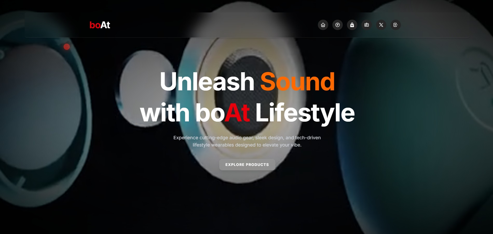
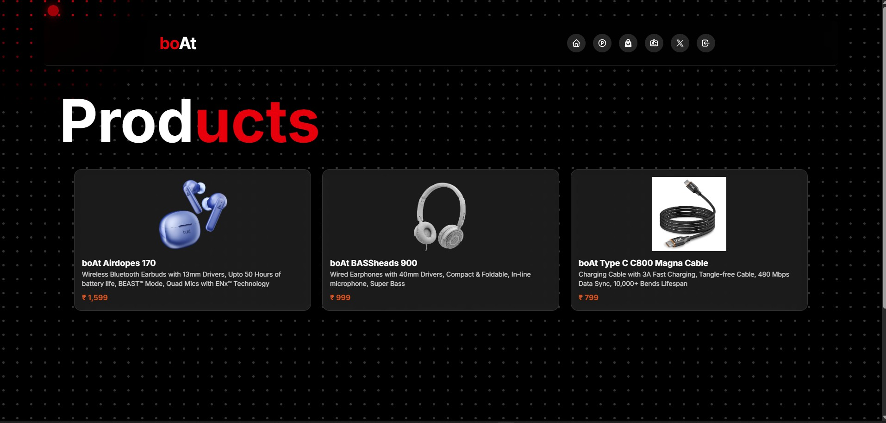
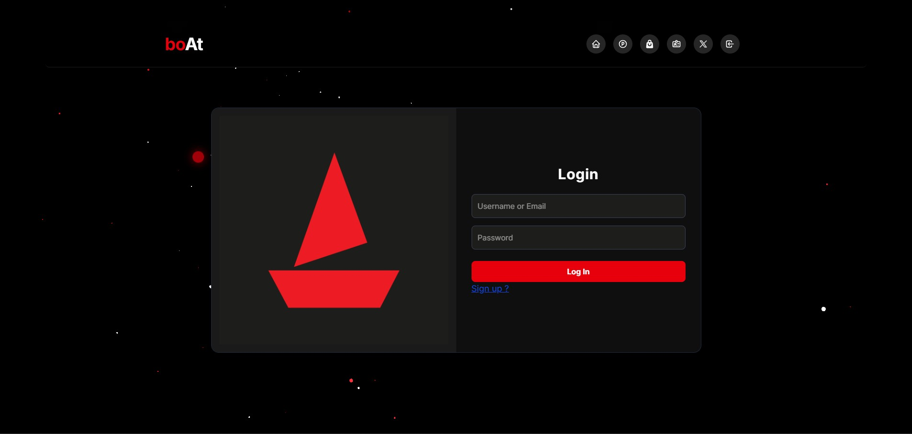

# 🎧 boAt Web Redevelopment

A visually enhanced, responsive **boAt-inspired eCommerce website** built using the modern frontend stack:  
React 19, TailwindCSS 4, Framer Motion, GSAP, Lenis, and more.

> ⚡️ Smooth animations. 🔄 Seamless scrolling. 📱 Fully responsive.  
> ✨ Designed to reflect the premium, youth-focused energy of boAt's brand.

---

## 🖼️ Preview

---

## 🔗 Live Demo

🚀 [View Live Website on Vercel] ([https://boat-web-redevelopment.vercel.app](https://boat-web-redevelopment.vercel.app/))  
🛠️ [Source Code on GitHub](https://github.com/akash-dev-lab/boat-web-redevelopment)

---

## 🛠️ Features

- ⚛️ **React 19** – with functional components & hooks
- 🎨 **TailwindCSS 4.1** – responsive design with utility-first CSS
- 💨 **Framer Motion** – dynamic page and component transitions
- 🌀 **Lenis Smooth Scroll** – buttery scroll behavior
- 🎯 **GSAP Animations** – fine-tuned scroll-based animations
- 🎉 **Canvas Confetti** – fun interactive button effects
- 🎥 **Lottie Animations** – support for animated assets
- 🔥 **Fully Responsive** – mobile-first design for all screen sizes
- 🧠 **Clean Architecture** – clear folder and component structure

---

## 📦 Tech Stack

| Category       | Library |
|----------------|---------|
| Framework      | `React 19.1` |
| Styling        | `TailwindCSS 4.1`, `clsx`, `tailwind-merge` |
| Animations     | `framer-motion`, `gsap`, `lenis`, `canvas-confetti`, `accertinity-ui`, `magic-ui`, `ReactBits` |
| UI Icons       | `@heroicons/react`, `lucide-react`, `tabler/icons-react` |
| Routing        | `react-router-dom v7` |
| Build Tool     | `Vite 7` |
| ESLint         | With `react-hooks`, `refresh` support |

---

## 📁 Project Structure

